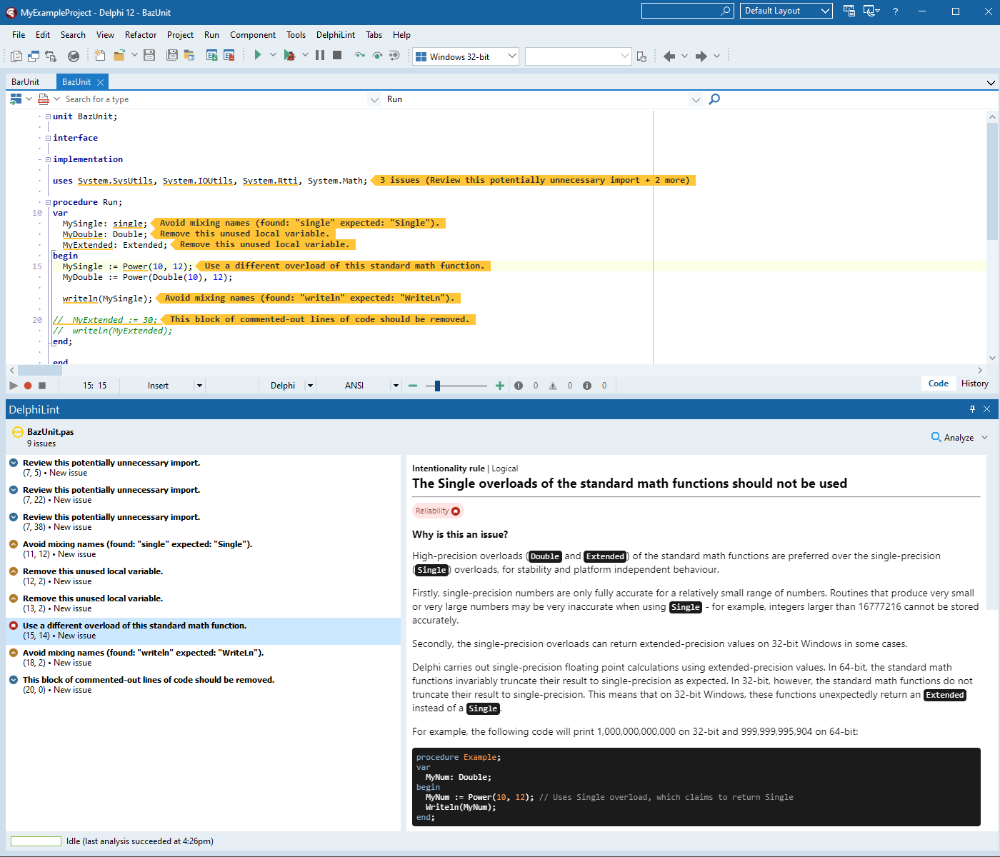

<h1 id="delphilint">
  <picture>
    <source media="(prefers-color-scheme: dark)" srcset="docs/images/delphilint-title-dark.png">
    <source media="(prefers-color-scheme: light)" srcset="docs/images/delphilint-title-light.png">
    
  </picture>
</h1>

 

DelphiLint is an IDE package for RAD Studio that provides on-the-fly code analysis and linting, powered by
[SonarDelphi](https://github.com/Integrated-Application-Development/sonar-delphi).

## Features

* Integration with [IntegraDev SonarDelphi](https://github.com/Integrated-Application-Development/sonar-delphi),
  including 100+ code analysis rules, both structural and semantic
* On-demand analysis in the Delphi IDE, both single-file and multi-file
* Two analysis modes:
   * Standalone - run analyses entirely locally with a default set of active rules
   * Connected - connect to a SonarQube instance, allowing for
      * Fetching of active rules and configuration from the server's configured quality profiles
      * Suppression of issues that have been resolved in past analyses
      * Usage of the server's version of SonarDelphi
* Support for reading `sonar-project.properties` files
* A Visual Studio Code companion that can be used to run analyses and show results in VS Code itself

## Gallery

## Installation

1. [Build DelphiLint from source](#building-from-source) or, if you are using Delphi 11.2, download the packaged zip
   artifact from [the latest release](https://github.com/Integrated-Application-Development/delphilint/releases/latest).
2. Download or compile the latest SonarDelphi release from the [IntegraDev SonarDelphi repository](https://github.com/Integrated-Application-Development/sonar-delphi).
3. Unzip the DelphiLint package folder from step 1, then run `./setup.ps1 -SonarDelphiJarLocation <path>` inside it.
4. In RAD Studio, install DelphiLint by going to Components > Install Packages and navigating to the client .bpl.

### Installing the VS Code companion

1. [Build the VS Code companion from source](#building-the-vs-code-companion) or download the .vsix artifact from
   [the latest release](https://github.com/Integrated-Application-Development/delphilint/releases/latest).
2. Run `code --install-extension <vsix>` to install the extension.

Note that there must be a DelphiLint installation with a matching version for the companion to work, as it looks for
a server that matches its version. For example, the version of DelphiLint on the latest `master` will not be compatible
with the version of the VS Code companion bundled with the most recent release - you will either have to check out the
most recent release commit and [build DelphiLint from there](#building-from-source) (recommended), or
[build the VS Code companion yourself](#building-the-vs-code-companion) from latest `master`.

## Building from source

Prerequisites:

* RAD Studio 11
* Maven 3.5.0+
* Java 11+

1. Clone the repository at the latest release.
2. Build the server project by running `/server/build.ps1`.
3. Build the client project by compiling `/client/source/DelphiLintClient.dproj` in Release with Delphi 11 or above.
4. (Optional) [Build the VS Code companion.](#building-the-vs-code-companion) If this step is skipped, pass
   `-NoCompanion` to the package script in the next step.
5. Run `/package.ps1` and follow the instructions to create a .zip containing all the build artifacts and a setup script.

### Building the VS Code companion

Prerequisites:

* npm
* VS Code
* VS Code Extension Manager (Can be installed with `npm install --global @vscode/vsce`)

1. Clone the repository at the latest release.
2. In `/companion/delphilint-vscode`:
   1. Run `npm install`.
   2. Run `vsce package` to create a `.vsix` file in `/companion/delphilint-vscode`.
3. Run `code --install-extension <vsix>` to install the extension.

## Usage

DelphiLint adds a menu item to the main menu with a number of options:

| Menu item              | Description                                                                                                                                                   |
|------------------------|---------------------------------------------------------------------------------------------------------------------------------------------------------------|
| Show DelphiLint        | Show the main DelphiLint window. This window shows analysis status and results, including issues in the active file.                                          |
| Analyze This File      | Run an analysis on the file that is currently visible in the editor.                                                                                          |
| Analyze All Open Files | Run an analysis on all project files that are currently open in the IDE.                                                                                      |
| Project Options...     | Configure [analysis options](#project-configuration) for the current Delphi project, including analysis root and SonarQube connection information.            |
| Settings...            | Configure settings for the tool in general.                                                                                                                   |
| Restart Server         | Terminate the background analysis server and start a new instance. This can be used if the server is unresponsive.                                            |

### Project configuration

Project-level options can be configured via `DelphiLint > Project Options...` and are stored in a `.delphilint` file
next to the Delphi project (`.dproj`) file.

| Option                                                       | Description                                                                                                                                              |
|--------------------------------------------------------------|----------------------------------------------------------------------------------------------------------------------------------------------------------|
| Analysis mode                                                | The analysis mode to run in. See [Features](#features) for more details.                                                                                 |
| Analysis settings > Base directory                           | The root directory for the analysis. Only files in this directory or subdirectories will be analyzable.                                                  |
| Analysis settings > Read sonar-project.properties if present | Whether to read a sonar-project.properties file if one is found in the base directory.                                                                   |
| SonarQube connection > Server URL                            | The URL of the SonarQube host to connect to when in connected mode.                                                                                      |
| SonarQube connection > Project key                           | The key of the corresponding SonarQube project on the SonarQube host. Optional.                                                                          |
| SonarQube connection > Authorization token                   | A user token to be used to authenticate with the SonarQube host. Optional, but required if "Force user authentication" is enabled on the SonarQube host. |
| Sonarqube connection > Use server's SonarDelphi version      | Whether to download the server's version of the SonarDelphi plugin or use the version embedded with DelphiLint.                                          |

The default DelphiLint project configuration is Standalone, with the base directory as the directory containing the
Delphi project file. SonarQube settings are ignored when in standalone mode.

## Contributing

DelphiLint is open for contributions, from bug reports to new features. GitHub issues and pull requests are the core
locations for community involvement - check them out!

### Reporting bugs

Bugs can be reported on the [GitHub issue tracker](https://github.com/integrated-application-development/delphilint/issues).
When reporting a bug, please do the following:
* Check that your issue has not already been reported
* Include the versions of SonarDelphi (and SonarQube, if applicable) you are using
* Be as specific as possible in your description
* If applicable, supply a minimal case that replicates the issue

### Requesting features

Feature requests can be listed on the
[GitHub issue tracker](https://github.com/integrated-application-development/delphilint/issues).
Note that this does not necessarily mean a developer will decide to implement the feature - if you would like a feature
consider implementing it yourself and [making a pull request](#making-pull-requests).

When requesting a feature, please do the following:
* Check that a similar feature has not already been requested
* Be as specific as possible in your description

### Making pull requests

[Pull requests](https://github.com/integrated-application-development/delphilint/pulls) are welcome!
When making a pull request, please do the following:
* Ensure that the functionality is widely useful rather than specific to your use case
* For new features, ensure that it has been discussed in an issue prior to making the pull request
* Describe the contents of your pull request
* Clearly explain the rationale for adding it to DelphiLint

## Troubleshooting

#### When I go to analyze a file, it says "File not analyzable" and analysis is greyed out.

Make sure that your project base directory is correctly configured in the options of your current project, and that
the file is a Delphi source file (`.pas`, `.dpr`, `.dpk`).
Only Delphi source files under the base directory (including in subdirectories) are able to be analyzed.

#### "Analyze All Open Files" does not analyze my `.dpr` or `.dpk` file, even though it is open.

This is intentional, as analyzing `.dpr` and `.dpk` files typically raises a large number of erroneous issues due to
dependency analysis limitations. `.dpr` and `.dpk` files can be explicitly analyzed using "Analyze This File".

#### DelphiLint has been stuck in analysis for a long time.

Generally speaking, DelphiLint analyses can take upwards of 30 seconds when dealing with files with many imports. If it
has been a longer time, check the progress of the scan in the logs at
`%APPDATA%\DelphiLint\logs\delphilint-server.log`. If a problem seems to have occurred, the server can be restarted
with `DelphiLint > Restart Server`.