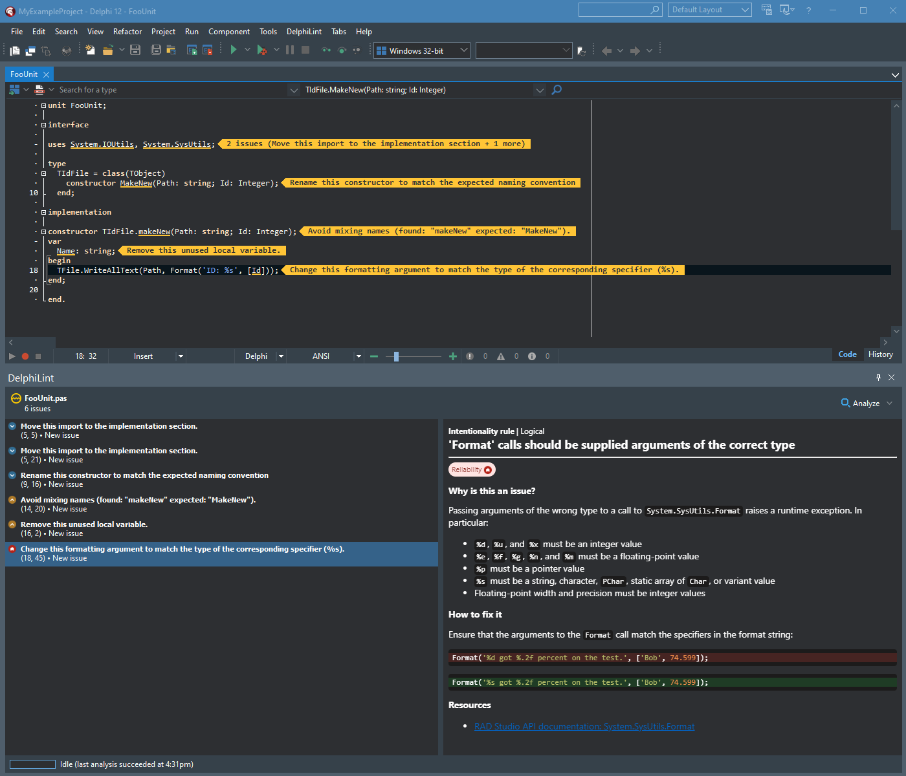

<h1 id="delphilint">
  <picture>
    <source media="(prefers-color-scheme: dark)" srcset="docs/images/delphilint-title-dark.png">
    <source media="(prefers-color-scheme: light)" srcset="docs/images/delphilint-title-light.png">
    
  </picture>
</h1>

 

DelphiLint is an IDE package for RAD Studio that provides on-the-fly code analysis and linting, powered by
[SonarDelphi](https://github.com/integrated-application-development/sonar-delphi).

## Features

* Brings [SonarDelphi](https://github.com/integrated-application-development/sonar-delphi),
  a static analyzer for Delphi with 100+ code analysis rules, to the Delphi IDE
* Analyze one or more files on-the-fly, shortening the feedback loop so you can pick up and fix problems before they're even checked in
* Detected issues, along with descriptions and rationale, displayed inline in the IDE
* Two analysis modes:
   * Standalone - run analyses entirely locally with a default set of active rules
   * Connected - connect to a SonarQube instance, allowing for
      * Fetching of active rules and configuration from the server's configured quality profiles
      * Suppression of issues that have been resolved in past analyses
      * Usage of the server's version of SonarDelphi
* Support for reading standard `sonar-project.properties` files, providing additional configuration
* A Visual Studio Code companion extension that can be used to run analyses and show results in VS Code itself

## Installation

System requirements:

* Microsoft Edge 79.0.309+
* [Delphi 11+](https://www.embarcadero.com/products/delphi)
* [Java 11+](https://adoptium.net/temurin/releases/?package=jre&version=17)

Installation steps:

1. Download the packaged zip for your Delphi version from [the latest release](https://github.com/integrated-application-development/delphilint/releases/latest), or [build from source](#building-from-source).
2. Unzip the folder and run the included `install.bat` script.
3. Done!

### Installing the VS Code companion

1. Download the .vsix extension file from [the latest release](https://github.com/integrated-application-development/delphilint/releases/latest),
   or [build from source](#building-the-vs-code-companion).
2. Run `code --install-extension <vsix>` to install the extension.

> [!IMPORTANT]
> For the companion to work, a DelphiLint installation of the same version must be installed.
>
> The VS Code companion is **not** required for the Delphi IDE plugin to function.

## Building from source

Prerequisites:

* [Delphi 11+](https://www.embarcadero.com/products/delphi)
* [JDK 11+](https://adoptium.net/temurin/releases/?package=jdk&version=17)
* [Maven 3.5+](https://maven.apache.org/)
* [npm](https://www.npmjs.com/)
* Microsoft Edge 79.0.309+
* PowerShell execution policy set to `Unrestricted` (see [MSDN](https://learn.microsoft.com/en-us/powershell/module/microsoft.powershell.core/about/about_scripts?view=powershell-7.4#how-to-run-a-script))

To build DelphiLint, use `scripts/build.ps1`:

* `scripts/build.ps1 280` to build for Delphi 11 Alexandria
* `scripts/build.ps1 290` to build for Delphi 12 Athens

This creates a `target/DelphiLint-<version>-` folder containing all built artifacts.

> [!NOTE]
> `build.ps1` looks for a Delphi installation in the default location for the given version.
> If your installation is elsewhere, supply the location as part of the version parameter, e.g.
> `scripts/build.ps1 280=/my/custom/location`.

## Usage

To analyze a file:

1. Open a Delphi project in the IDE.
2. Open the Delphi source file you want to analyze.
3. Click the `DelphiLint > Analyze This File` menu option.

It's as easy as that! The DelphiLint window will then pop up, showing the current state of analysis and any issues
that are raised. Please note that when the file has a lot of imports the analysis could take thirty seconds or so.

To analyze all files that are open in the IDE, use `DelphiLint > Analyze All Open Files` instead.

## Gallery

## Contributing

DelphiLint is open for contributions - please read the [contributing guide](docs/CONTRIBUTING.md) for more information.

## License

Licensed under the [GNU Lesser General Public License, Version 3.0](http://www.gnu.org/licenses/lgpl.txt).
