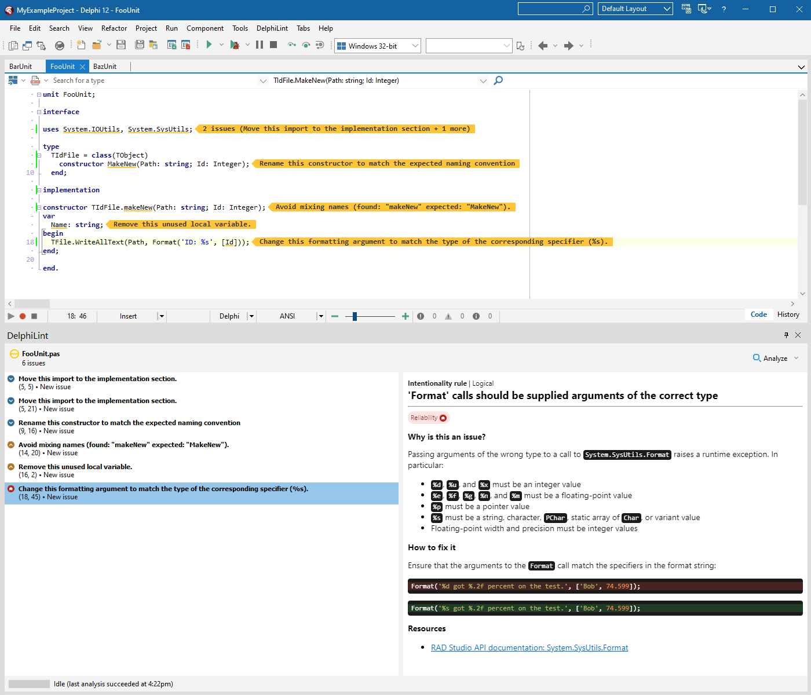

<h1 id="delphilint">
  <picture>
    <source media="(prefers-color-scheme: dark)" srcset="docs/images/delphilint-title-dark.png">
    <source media="(prefers-color-scheme: light)" srcset="docs/images/delphilint-title-light.png">
    
  </picture>
</h1>

 

DelphiLint is an IDE package for RAD Studio that provides on-the-fly code analysis and linting, powered by
[SonarDelphi](https://github.com/integrated-application-development/sonar-delphi).

## Features

* Integration with [IntegraDev SonarDelphi](https://github.com/integrated-application-development/sonar-delphi),
  including 100+ code analysis rules, both structural and semantic
* On-demand analysis in the Delphi IDE, both single-file and multi-file
* Two analysis modes:
   * Standalone - run analyses entirely locally with a default set of active rules
   * Connected - connect to a SonarQube instance, allowing for
      * Fetching of active rules and configuration from the server's configured quality profiles
      * Suppression of issues that have been resolved in past analyses
      * Usage of the server's version of SonarDelphi
* Support for reading `sonar-project.properties` files
* A Visual Studio Code companion that can be used to run analyses and show results in VS Code itself

## Installation

1. [Build DelphiLint from source](#building-from-source) or, if you are using Delphi 11.2, download the packaged zip
   artifact from [the latest release](https://github.com/integrated-application-development/delphilint/releases/latest).
2. Download or compile the latest SonarDelphi release from the [IntegraDev SonarDelphi repository](https://github.com/integrated-application-development/sonar-delphi).
3. Unzip the DelphiLint package folder from step 1, then run `./setup.ps1 -SonarDelphiJarLocation <path>` inside it.
4. In RAD Studio, install DelphiLint by going to Components > Install Packages and navigating to the client .bpl.

### Installing the VS Code companion

1. [Build the VS Code companion from source](#building-the-vs-code-companion) or download the .vsix artifact from
   [the latest release](https://github.com/integrated-application-development/delphilint/releases/latest).
2. Run `code --install-extension <vsix>` to install the extension.

> [!IMPORTANT]
> For the companion to work, a DelphiLint installation of the same version must be installed.

## Building from source

Prerequisites:

* RAD Studio 11
* Maven 3.5.0+
* Java 11+
* PowerShell

1. Clone the repository at the latest release.
2. Build the server project by running `/server/build.ps1`.
3. Build the client project by compiling `/client/source/DelphiLintClient.dproj` in Release with Delphi 11 or above.
4. (Optional) [Build the VS Code companion.](#building-the-vs-code-companion) If this step is skipped, pass
   `-NoCompanion` to the package script in the next step.
5. Run `/package.ps1` and follow the instructions to create the setup zip.

### Building the VS Code companion

Prerequisites:

* npm
* VS Code
* VS Code Extension Manager (Can be installed with `npm install --global @vscode/vsce`)

1. Clone the repository at the latest release.
2. In `/companion/delphilint-vscode`:
   1. Run `npm install`.
   2. Run `vsce package` to create a `.vsix` file in `/companion/delphilint-vscode`.
3. Run `code --install-extension <vsix>` to install the extension.

## Usage

To analyze a file:

1. Open a Delphi project in the IDE.
2. Open the Delphi source file you want to analyze.
3. Click the `DelphiLint > Analyze This File` menu option.

It's as easy as that! The DelphiLint window will then pop up, showing the current state of analysis and any issues
that are raised. Please note that when the file has a lot of imports the analysis could take thirty seconds or so.

To analyze all files that are open in the IDE, use `DelphiLint > Analyze All Open Files` instead.

## Gallery

## Contributing

DelphiLint is open for contributions - please read the [contributing guide](docs/CONTRIBUTING.md) for more information.

## License

Licensed under the [GNU Lesser General Public License, Version 3.0](http://www.gnu.org/licenses/lgpl.txt).
