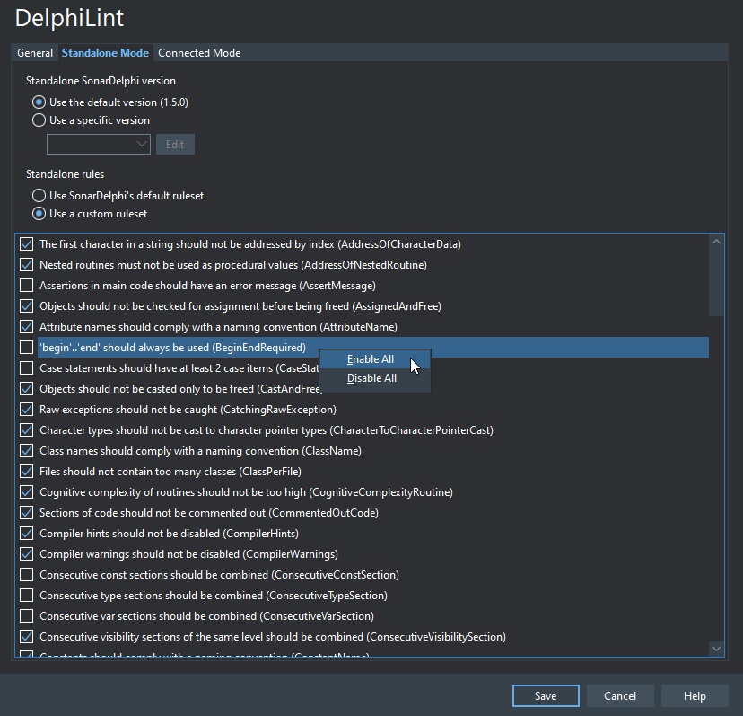

# Configuration

## Project configuration

Project-level options can be configured via `DelphiLint > Project Options...` and are stored in a `.delphilint` file
next to the Delphi project (`.dproj`) file.

| Option                                                       | Description                                                                                                                                              |
|--------------------------------------------------------------|----------------------------------------------------------------------------------------------------------------------------------------------------------|
| Analysis mode                                                | The analysis mode to run in.                                                                                                                             |
| Analysis settings > Base directory                           | The root directory for the analysis. Only files in this directory or subdirectories will be analyzable.                                                  |
| Analysis settings > Read sonar-project.properties if present | Whether to read a sonar-project.properties file if one is found in the base directory.                                                                   |
| SonarQube connection > Server URL                            | The URL of the SonarQube host to connect to when in connected mode.                                                                                      |
| SonarQube connection > Project key                           | The key of the corresponding SonarQube project on the SonarQube host. Optional.                                                                          |
| SonarQube connection > Authorization token                   | A user token to be used to authenticate with the SonarQube host. Optional, but required if "Force user authentication" is enabled on the SonarQube host. |
| Sonarqube connection > Use server's SonarDelphi version      | Whether to download the server's version of the SonarDelphi plugin or use the version embedded with DelphiLint.                                          |

The default DelphiLint project configuration is Standalone, with the base directory as the directory containing the
Delphi project file. SonarQube settings are ignored when in standalone mode.

## User configuration

User settings can be configured via `DelphiLint > Settings...` and are stored in `%APPDATA\DelphiLint\delphilint.ini`.
(This file should not be edited directly unless you know what you're doing.)

### Configuring rules in standalone mode

> [!NOTE]
> When in connected mode, SonarDelphi uses the project's configured quality profile. This includes which active rules
> to apply, and the parameters provided to them.

The ruleset used in standalone mode can be configured in `DelphiLint > Settings... > Standalone Mode`. By default,
the "Use SonarDelphi's default ruleset" option is selected, meaning that SonarDelphi's default "Sonar way" profile
will be enforced. The "Sonar way" profile does not include all of SonarDelphi's rules, but it is designed to provide
a sensible default option for Delphi analysis.

For greater control over the rules that are applied during analysis, by selecting the "Use a custom ruleset" option
you can manually enable or disable rules to suit your coding style. You can also use the right click context menu to
enable or disable *all* rules:

Please note that rule parameters cannot be configured in standalone mode.